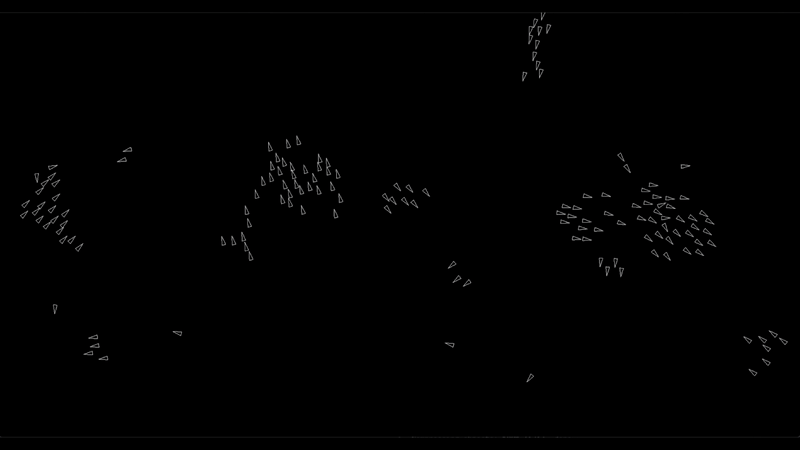

# Boids Simulation



## Overview

This project is a simple implementation of the [boids](https://en.wikipedia.org/wiki/Boids) algorithm, which simulates the flocking behavior of birds. The simulation was used as a way to explore emergent behavior, Odin, and Raylib.

Feel free to edit the values of the various weights, radii, speed, and number of boids.

### How to Run

1. Ensure you have the Odin programming language installed.
2. Clone the repository.
3. Navigate to the project directory.
4. Run the following command to start the simulation:

```sh
odin run src/main.odin
```

### Improvements

Currently, the implementation is pretty brute force and just iterates through every boid to calculate the various forces. Potential features and optimization improvements could include:
- **User Interface:** Create a user interface to allow real-time adjustments of parameters and visualization options. 
- **Spatial Partitioning:** Implement spatial partitioning techniques like a grid or a quadtree to reduce the number of boids that need to be checked for each interaction.
- **Parallel Processing:** Utilize parallel processing to update boids concurrently, taking advantage of multi-core processors.
- **Obstacle Avoidance:** Add obstacles to the environment and implement obstacle avoidance behavior for the boids.
